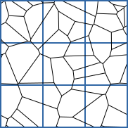
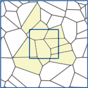
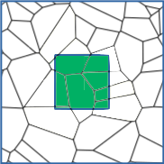
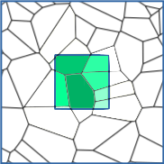

# portage Concepts      {#concepts}

The remapping algorithm within portage is divided into three phases,
which are roughly labelled as

1. _search_ - find candidate cells/particles that will contribute to
   remap of a given target cell/particle
2. _intersect_ - calculate the weight of each candidate's contribution
   to the remap of a given target cell/particle; this may include
   higher-order moments if requested.
3. _interpolate_ - using the weights and moments, along with
   appropriate limiters, reconstruct the field data for a given target
   cell/particle.

All of these operations work with your underlying mesh/particles and
state manager through wrappers that provide an interface to the
queries needed to perform any particular step.  For an example of the
requirements of the wrappers, see the [Example Use](@ref example)
page.  Below, when we refer to _mesh_ or _particles_ in terms
of the operations, we really mean _mesh wrappers_ and _particle swarm
wrappers_.  Particle methods are also referred to as _meshfree
methods_.

All operations consist of a _source_ mesh/particle swarm and a
_target_ mesh/particle swarm.  The _source_ entity is the one where we
have existing field data, and the _target_ entity is the object to which
we would like to remap the data.  For meshes, the field data can live
on either cell centers or node centers; particle data naturally lives
on particles, which can have various shapes and smoothing lengths.

## Search

Given source and target entities, this step simply _identifies_ which
parts of the source contribute to which parts of the target.
Concretely, for mesh-mesh remap this step would identify which source
cells overlap each target cell.

Portage has several search algorithms with varying degrees of
sophistication/speed.  These are the search methods for meshes:

- Portage::SearchSimple - 2d, bounding box search
- Portage::SearchKDTree - 2d or 3d parallel k-d tree search

For particle swarms, the search concepts are similar, except any sort
of bounding needs to take into account the fact that the particles can
have some extent via shape and kernel functions.  These are the search
methods for particles:

- Portage::SearchSimplePoints - any-d quadratic time search over
  particle swarms
- Portage::SearchPointsByCells - any-d linear time search over
  particle swarms using a bounding box containing particles and their
  smoothing lengths

## Intersect

Given the list of source candidates for intersection for a target
entity, this step calculates the actual weights going into the
intersection.

For meshes, this step uses exact intersection methods to calculate
various _moments_ of the polygon/polyhedron of intersection; moments
of higher order than the 0th (i.e. the area or volume of the
intersection) are needed for higher order remap.  It is possible that
some candidates are determined to have zero intersection, or that some
candidates have multiple intersections in the case of non-convex
cells.

The available intersectors for meshes are:

- Portage::IntersectClipper - 2d, exact intersection method based on
  the [Clipper](www.angusj.com/delphi/clipper.php) library for polygon
  intersection and clipping
- Portage::IntersectR2D - 2d, fast, exact polygonal intersection
  method based on the [r3d](https://github.com/laristra/r3d) library.
- Portage::IntersectR3D - 3d, fast, exact polyhedral intersection
  method based on the [r3d](https://github.com/laristra/r3d) library.

For particles, this step is referred to as _accumulation_.  The
distinction in terminology stems from the fact that for particles,
local regression estimators (LRE) are used to do the remap.  In this
stage, the LRE weights from particle contributions are accumulated by
computing the weight functions and local regression corrections to
those weights.  If LRE is performed with enough points, one can obtain
weights for arbitrary orders of derivatives of the field data, which
can be used to perform higher-order estimation.

The available meshfree method is:

- Portage::Meshfree::Accumulate - any-d accumulator that works with
  particles of various shapes, various kernel functions, utilizing
  various types of basis functions and estimator models.

## Interpolate

Given the list of source entities and their weighted contributions to
a given target entity, along with source field data, this step
actually populates the target field data on the target entities.
Performing higher-order reconstructions on meshes require more data to
construct gradients, hessians, etc., and limiters to ensure
monotonicity.  At mesh domain boundaries, limiting _can_ be ill-posed
if there are no boundary conditions; we currently do not support such
boundary conditions, so we do not limit at domain boundaries.
Furthermore, if the target mesh is not entirely contained within the
source mesh, then we currently have no mechanism for including
background or boundary conditions.

The current interpolation methods for meshes are the following:

- Portage::Interpolate_1stOrder - no limiting gets applied here.
- Portage::Interpolate_2ndOrder - capable of performing a
  limited linear fit (2nd order accurate).
- Portage::Interpolate_3rdOrder - capable of performing a
  least-squares, limited quadratic fit (3rd order accurate).

For particles, the terminology for the interpolate step changes to
_estimate_.  All of the heavy-lifting of the remap for particles has
been done in the accumulate phase, such that this step results in a
basic matrix vector multiply between the field data on source
particles and the weights taking into account various orders of
derivative information.

The available meshfree method is:

- Portage::Meshfree::Estimate - use the output of Portage::Accumulate
  to estimate the target field data with varying degrees of accuracy.

----

## Drivers

Portage comes with a few _drivers_ to help facilitate using the above
methods with your own mesh/particle data.  The drivers are all
templated on source and target mesh/particle swarm and state data.
Furthermore, they are templated on the Search, Intersect (or
Accumulate), and Interpolate (or Estimate) methods above.  In
particular, the following drivers are provided:

- Portage::Driver - for mesh-mesh remap
- Portage::Meshfree::SwarmDriver - for particle-particle remap
- Portage::MSM_Driver - for mesh to mesh remap with particles as an
  intermediary

The drivers are all used within our application tests within the
`apps` directory.  The applications choose a particular mesh or
particle swarm type, select specfic Search, Intersect, and Interpolate
algorithms, along with associated settings for remap order of
accuracy, data locality for meshes (cells or nodes), and any limiters
needed for higher-order remap.  Users are encouraged to write their
own specialized drivers, but the above should serve as a starting
point.
