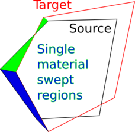

# Concepts      {#concepts}

## Design Principle

Portage is a framework for creating custom remappers from
interoperable components and not a monolithic, catch-all remapping
library. It is designed such that its major components can be mixed
and matched as necessary as long as they adhere to an interface. Its
design also seeks to minimize the amount of mesh and field data that
must be copied from clients in order to minimize data movement.

<!-- To include a figure like this you have to modify doxygen.conf.in
to tell Doxygen (via the HTML_EXTRA_FILES variable) to copy this file
from doxygen/images the main HTML directory -->


<br>

In order to enable this DIY design, Portage requires the remap driver
to be templated on all its component classes implementing the
necessary methods. It also requires the driver to be templated on the
mesh and state managers for the source and target respectively. The
individual components are also templated on the mesh and state
managers in turn. Each component is required to be designed as a
[_functor_](https://stackoverflow.com/questions/356950/what-are-c-functors-and-their-uses),
or in other words, a struct/class with an ```operator()(...)``` that
is functional, i.e. has no side effects.

The functional design allows a remap driver to be written such that
populating the fields on target entities is a nearly embarrassingly
parallel process on-node. Remapping on distributed meshes/swarms is
also embarrassingly parallel as long as the target and source
partitioning is geometrically matching. On the other hand, if there is
a geometric mismatch of the partitioning on the source and target,
i.e., source entities overlapping a target entity are on a different
node, Portage performs some communication and data movement in order
to get source mesh cells onto partitions needing them. Once this step
is concluded at the outset, the remap still shows excellent
scaling. More details are given in the @ref
distributed_concepts section and performance plots are shown in the
@ref scaling section.


<a name="Drivers-Apps"></a>
## Drivers and Applications

Portage does come with some full-featured _drivers_ that can be
directly used to deploy a powerful remapping capability into an
application. In particular, the following drivers are provided:

- Portage::MMDriver - for single- and multi-material mesh-mesh remap.
- Portage::Meshfree::SwarmDriver - for particle-particle remap.
- Portage::MSM_Driver - for mesh-mesh remap with particles as an
  intermediary.

These drivers are all used within some example applications within the
`apps` directory to illustrate how the drivers can be used with a mix
of components.  The applications choose a particular mesh or
particle swarm type, select component classes for the remapping steps
along with associated settings for the remap process. The drivers,
apps and the regression tests included with the apps are all fairly
comprehensive and exercise all functionality of the Portage
framework. Therefore, the included drivers and some of the apps can be
used as-is if they meet all the needs of a particular application.


## Mesh/Particle and State data

The remapping problem starts with a _source_ mesh (or particle swarm)
with field data and a _target_ mesh (or particle swarm) onto which
the data must be remapped. For meshes, the field data can live on
cell centers or on nodes; particle data naturally lives on
particles which can have various shapes and smoothing lengths.

All of Portage's components work directly (to the extent possible -
see @ref distributed_concepts) with an application's
mesh/particle data and field data respectively. Portage accesses this
data through _mesh_ (or _swarm_) and _state wrapper classes_ that
provide an interface to the queries needed to perform any particular
step. For an illustration of the use of the wrappers in Portage, see
the [Example Use](@ref example) page. More details about the
requirements of mesh and state wrappers are given in the documentation
of the support package, [Wonton](https://github.com/laristra/wonton).

<a name="mesh-mesh remap"></a>
## Single Material Mesh-Mesh Remapping

The remapping algorithm within Portage for _single_ material problems
between two meshes [1][2] is divided into four
phases (described here for cell-based fields):

* **search** - find candidate source cells that will contribute to
   remap of each target cell
* **intersect** - calculate the weight of each candidate's contribution
   to the remap of a given target cell
* **interpolate** - using the weights and source field data
   reconstruct the field data for each target cell
* **repair** - repair the remapped field due to errors resulting from
   mismatch of the two mesh boundaries

<table style="width:100%">
<tr>
<td valign="top"></td>
<td width="4%"></td>
<td valign="top"></td>
<td width="4%"></td>
<td valign="top"></td>
<td width="4%"></td>
<td valign="top"></td> 
</tr>
<tr>
<td width="22%" valign="top">A mesh-mesh configuration.  Blue is target mesh, black is source
mesh.</td>
<td width="4%"></td>
<td width="22%" valign="top">Candidates are in yellow.</td>
<td width="4%"></td>
<td width="22%" valign="top">The exact intersectiion volumes are in green.</td>
<td width="4%"></td>
<td width="22%" valign="top">The intersection weights are combined to interpolate data in the
target cell.</td>
</tr>
</table>

The schematic above shows the algorithm when each target
cell has access to all source cells that overlap it. As mentioned
above, an initial source redistribution step (see @ref distributed_concepts) must be executed if the source and
target mesh partitions are not geometrically aligned.

### Search

Given source and target entities, this step simply _identifies_ which
source mesh entities might contribute to each target mesh
entity. Concretely, for exact intersection based remap of cell fields,
this step identifies which source cells potentially overlap each
target cell.

Portage makes available the following search algorithms with varying degrees of
sophistication/speed:

- Portage::SearchSimple - 2d, bounding box search
- Portage::SearchKDTree - 2d or 3d, k-d tree search (not a true parallel k-d tree)

Application developers may use their own search algorithms (like a
quadtree or hashed octree algorithm).

### Intersect

This step calculates the contribution weights from the candidate
source cells to a target cell. Portage currently uses
exact intersection methods to calculate various _moments_ of the
polygon/polyhedron of intersection. First order accurate remap needs
only the 0th moments (area/volume) of intersection but second order
remap requires the 1st moments (effectively, the centroids of the
intersection polyhedra).

The available intersectors for meshes in Portage are:

- Portage::IntersectClipper - 2d, exact intersection method based on
  the [Clipper](www.angusj.com/delphi/clipper.php) library for polygon
  intersection and clipping (Unit tested in Portage but not used
  widely in the App tests)
- Portage::IntersectR2D - 2d, fast, exact polygonal intersection
  method based on the [r3d](https://github.com/laristra/r3d, 
  https://github.com/devonmpowell/r3d.git(commit d6799a58)) library.
- Portage::IntersectR3D - 3d, fast, exact polyhedral intersection
  method based on the [r3d](https://github.com/laristra/r3d,
  https://github.com/devonmpowell/r3d.git(commit d6799a58)) library.

_The R2D/R3D-based intersectors in Portage are capable of intersecting
two non-convex cells based on the ability of R2D/R3D to clip
non-convex polygons/polyhedra. Therefore, in Portage's intersectors
source mesh cells are left as is regardless of whether they are convex
or non-convex but target cells are decomposed into simplices and the
simplices intersected with the source cells (unless they are
explicitly told that the target cells are strictly convex). The
simplices are derived from the side/wedge data structures built by
Wonton::AuxMeshTopology class. Note that Portage considers hexahedral
cells (or any higher polyhedra) with curved faces also as
non-convex. When remapping multi-material fields, a source mesh should
consist of at least star-convex cells. General non-convex cells would
require a different simplex decomposition method in
Wonton::AuxMeshTopology class._

Applications can choose to supply their own exact cell-cell
intersectors or even an alternate algorithm such as the _swept face_
calculation of contributions from source to target cells sometimes used in
Arbitrary-Lagrangian-Eulerian methods.

### Interpolate

Given the source field data, along with the list of source cells and
their contribution weights to each target cell, the interpolate step
actually populates the field on the target cells. The first order
accurate interpolation is simply a weighted sum of the source field
values, where the weights are the intersection volumes of the target
cells with the source mesh. For second order accurate interpolation, a
local linear reconstruction of the source field based on a least
squares gradient is used to compute more accurate contributions to the
target cell. Local bounds preservation may be enforced using limited
gradients (see Portage::Limiter_type) - this ensures that the remapped
value in any target cell will be bounded by the cell values of any
intersecting source cells and their immediate neighbors. At domain
boundaries, however, limiting _can_ be ill-posed if there are no
boundary conditions; we currently do not support such boundary
conditions, so we do not limit at domain boundaries. The linear
reconstruction requires knowledge of the first moments or centroids of
the intersection volumes.

The current interpolation methods for meshes are the following:

- Portage::Interpolate_1stOrder - 1st order accurate, reproduces a
  constant field.
- Portage::Interpolate_2ndOrder - 2nd order accurate, reproduces a 
  linear field.

As with search and intersect components, applications can furnish their
custom interpolation methods.

<br>

For remapping node fields, Portage uses the dual cells of the mesh to
perform the remapping steps. _Note that the use of 2nd order
interpolation to node fields is not guaranteed to preserve linear
fields or give second order accurate results._ This is because for the
method to be second-order accurate the linear reconstruction in the
source cell (or dual cell) is with respect to the field value at its
centroid; for the dual mesh, however, the field values are known at
the nodes, not necessarily the centroids of the dual cells. Also, dual
cells in a general mesh are almost guaranteed to be
non-convex. Therefore, intersection of dual cells always includes a
decomposition of the target dual cell into simplices based on
wedges/corners in Wonton::AuxMeshTopology.

Portage currently does not have an algorithm in place for remapping
nodal fields to cells and vice-versa although a driver to do such a
thing can be written easily.

### Mismatch Fixup or Repair

Often, the boundaries of the source and target meshes in simulations
do not exactly match up. This may happen because curved boundaries are
discretized with different resolutions in the two meshes or because
two physics packages view the geometry of the domain a bit
differently. If all of the source mesh is not covered by the target
mesh or vice versa, the result may violate conservation or introduce
artifacts in the fields.  Therefore, in this step the field is
repaired by one of several methods as described in the [Mismatch
Fixup](@ref mismatch_fixup) section. The options for handling fully
empty cells are in the enum Portage::Empty_fixup_type and the options
for repair of partially covered cells are in the enum
Portage::Partial_fixup_type.

<br>

<a name="mesh-mesh mmremap"></a>
## Multi-material remapping

Portage is also capable of remapping fields for a sparse
multi-material problem, one in which the source mesh has cells
possibly containing more than one material but not all materials occur
in every cell [3]. The materials in each cell are specified by their
volume fractions and optionally, by their centroids. Each
multi-material field on the source mesh has as many values in a cell
as there are materials in the cell.  _Multi-material remapping cannot
be used with particle swarms nor does it make sense for nodal field
remap_.

The algorithm for multi-material remapping involves the use of an
external interface reconstruction package called [Tangram]
(https://github.com/laristra/tangram) to perform reconstruction of
pure material polygons within each cell using the volume fraction (and
possibly centroid) data. Tangram is designed similar to Portage in
that one can use it with default or custom components. It has within
its suite of methods Volume-of-fluid and Moment-of-fluid
methods.

The algorithm for remapping of multi-material fields is broadly
similar to the single material remap but now the intersection and
interpolation must be done per material. Thus the algorithm can be
roughly described as below:

* **search** - find candidate cells that will contribute to
   each target cell
* **interface reconstruct** - given volume fractions of materials (and
   optionally, centroids) on the source mesh, compute a subdivision of
   each source cell into pure material polygons
* For each material *m* in problem:
   1. **intersect** - calculate the contribution of material *m* 
       from each candidate cell to a given target cell. This is done
       by intersecting the material *m*'s reconstructed polygon (if it
       exists) in the source cell with the target cell
   2. **populate materials** - based on intersection moments, determine
      the cells in which this material appears
   3. **interpolate** - using the intersection weights and moments, along with
      appropriate limiters, reconstruct the field data for material
      *m* for a given target cell. No limiting is performed at
      material interfaces
   4. **repair** - repair the remapped field due to errors resulting
      from mismatch of the two mesh boundaries (*not yet implemented*)

Remap of mesh fields on cells and nodes (one value per cell or node)
proceeds as in the single material case.

The above steps describe what is called a *material-dominant
loop* - the outer loop is over materials and within each iteration all
cells containing this material are processed. Also note that, for
a particular field, the interpolate step requests a *contiguous field
data* corresponding to *all cells in a particular material* (See
Wonton documentation for details of the programming interface).

We recognize that not all applications store their fields in the same
way. A few store field data in a *full data structure* wherein field
values are stored for every material in the problem in every
cell. Most applications store this data compactly in *cell-centric* or
*material-centric* representations. In the *cell-centric* form,
each cell keeps track of which materials it has and the field values
corresponding to those materials. On the other hand, *material-centric*
data representations maintain lists of cells that contain a particular
material (or put another way, the cells that a material contains) and
track the field values of the material cells. These differences
have strong implications for which loops (cell-dominant or
material-dominant) work best for each storage pattern.

Based on a study [4] of multi-material data structures, the
Portage team has concluded that a material dominant loop for remapping
is likely to be more cache-friendly and therefore, more performant
since this is a memory bound algorithm. The team also has designed the
state wrappers to retrieve data in a material-centric way, based on
the same study's conclusion that accessing cell-centric data in
material-dominant loops and vice versa is highly detrimental to
performance. **Therefore, we recommend that the field data be
transformed, if necessary, within the state wrapper to a
material-centric form before remapping and believe that the cost of
this transformation will be less than that of accessing the data in an
inefficient way.**


<br>

## Swept-face approximate remapping
 
In addition to the remap using mesh-mesh intersections, Portage
offers an approximate method [1] to calculate contribution weights
from the candidate source cells. This method is called swept-face
method, because the mesh-mesh intersections are replaced by
simple regions defined by the displacement of faces between a source
mesh and a target mesh. Therefore, this method requires that
both meshes have the same topology and only small nodal displacement.

### Single material remap



Following four phases described earlier, namely: **search**, **intersect**,
**interpolate** and **repair**, the main difference lies inside the **intersect** phase.
The swept-face **intersect** algorithm can be summarized as:

* For each face *f* of a computational cell *c*, create a swept-face polygon/polyhedron
  and calculate its signed volume.
  Note that the polygon can be self-intersecting.

* Based on the sign of the volume,
  assign this volume (and higher moments) either to the cell *c* or to a neighboring
  cell which is sharing the face *f* with the cell *c*.

* In addition to contributions from the face displacement, the volume of the cell *c* itself
  is assigned to the cell *c*, so that the target data can be expressed as
  a weighted sum over all these contributions in the same way as for the
  default exact intersections. Therefore, the **interpolate** phase is the same as for
  intersection based remap.

Thanks to the same connectivity of a source mesh and a target mesh, the **search**
phase is trivial. A list of face-neighboring cells is created in this phase. 
**Repair** phase is the same as for the default intersection-based remap.

### Multi material remap


###### An example of two swept regions projected into their corresponding face-cell groups for a multi-material remap

Preservation of material volumes requires more sophisticated method for the
multi-material swept-face remap. To make use of interface reconstruction in
source cells, swept regions are projected into corresponding cells based
on their signed volumes. This is done in following steps during the **intersect**
phase:

* Create a polygon/polyhedron *p* by adding a centroid of a cell *c*
  to a face *f*. This poly defines a face-cell group *fc*.

* Find a cutting plane in the direction of an effective normal of the face *f*
  in such a way that the volume of the poly *p* under the plane is equal
  to the the swept volume.

* Cut material polygons associated with a face-cell group *fc* with the
  cutting plane to get material volumes (and higher moments) which
  are assigned to the cell *c*. Material volumes from the cell itself have to be added
  to the contribution as described in the single-material case.

<br>

<a name="meshfree remap"></a>
## Particle or Meshfree Remapping

Portage can estimate functions and derivatives between particle swarms (groups of
particles) employing  algorithmic devices similar to those of mesh-mesh remap. 
We say "estimate" instead of "interpolate" because in general, meshfree 
function estimates pass *near* the data, and not *through* it. 
Meshfree remap is performed in the following steps that echo
those of mesh-mesh remapping:

* **search** - find candidate source particles that will contribute to
   remap at each target particle.
* **accumulate** - calculate the weight of each candidate's contribution
   to the remap at a given target particle.
* **estimate** - using the weights reconstruct the field data for a
   given target particle.

The following figure illustrates typical source and target swarms used for remapping. There are no lines 
connecting data points. 
<table style="width:100%">
<tr>
<td valign="top"></td>
</tr>
<tr>
<td width="22%" valign="top">A swarm-swarm remap configuration.  Blue is source, red is target.</td>
</tr>
</table>

There are many possible meshfree methods to choose from. Portage currently employs the 
Kernel Density Estimator (KDE), the basis of the Smooth-Particle Hydrodynamics method (SPH), 
and the well developed Local Regression Estimator (LRE) [5][6]. If LRE is performed with 
sufficient point density, one can obtain weights for arbitrary orders of derivatives of the 
field data enabling higher-order estimation of fields. It can even be used to estimate 
integral operators of the field data on small domains. It has many exceptional properties 
that render it useful and practical.


### Search

For particle swarms, the search concepts are similar, with one imporant 
difference. With meshes, the region of influence of a data point is 
given by the cell that includes or is connected to it. With particles, the 
region of influence of a data point is determined by the support of a weight 
function that includes it. A typical weight function is positive, smooth and unimodal, 
with compact support, as shown below. 

<table style="width:100%"> 
<tr>
<td valign="top"></td>
</tr>
<tr>
<td width="22%" valign="top"> A typical weight function. The peak value is typically 1 and the 
minimum zero, with compact support. </td>
</tr>                                                                                                                              
</table> 

A weight function support need not be spherical, as illustrated above. Suitable weight 
functions can be constructed 
with supports comprised of ellipses, boxes, or arbitrary polygons or polyhedra. 
A smooth weight function used for particles generalizes the "top-hat" or unitary 
weight function used for meshes that has a value of 1 inside the cell and 0 outside. 
Meshes are a special case of particles. In fact, under certain conditions on the weight function, 
the LRE reproduces finite element nodal shape functions. 

The centers of the weight function supports are typically located in two places. 
If on the target particles, the estimator 
is called "gather-form", if on the source particles, the estimator is called "scatter-form", 
illustrated below.

<table style="width:100%">
<tr>
<td valign="top"></td>
<td width="4%"></td>
<td valign="top"></td>
</tr>
<tr>
<td width="22%" valign="top">Gather-form search. The centers of the weight function supports are 
located at the target particle centers.</td>
<td width="4%"></td>
<td width="22%" valign="top">Scatter-form search. The centers of the weight function supports are 
located at the source 
particle centers. The supports need not all have the same shape.</td>
</tr>
</table>

The weight function kernel and shape are specified by 
Portage::MeshFree::Weight::Kernel and Portage::MeshFree::Weight::Geometry. 

Any sort of bounding performed, e.g. to partition among processors, 
needs to take into account the extent of the weight function supports. 
These are the search methods for particles:

- Portage::SearchSimplePoints - any-d quadratic time search over
  particle swarms
- Portage::SearchPointsByCells - any-d linear time search over
  particle swarms using a bounding box containing the particles and their
  extent based on smoothing lengths

The weight function location is specified by Portage::MeshFree::WeightCenter. 
A set of input smoothing lengths
determine the size of the weight function support.

### Accumulate

Most meshfree methods make approximations by means of discrete kernel transforms, 
which involve summing data values times kernel values at various points. Even though 
the kernels are defined over the entire swarm, compact support means only a small 
number of particles typically have non-zero values. The set of such particles 
is analogous to the stencil used in a meshed method. 

For LRE, discrete transforms of different powers of the particle coordinates are made (moments), 
assembled into a matrix, solved against a vector of moments and finally multiplied by 
the kernel function. This yields a set of weights for each neighboring particle data value, one 
for each derivative estimate. The concept for gather and scatter forms applied to the second 
moment of position is illustrated below. 

<table style="width:100%">
<tr>
<td valign="top"></td>
<td width="4%"></td>
<td valign="top"></td>
</tr>
<tr>
<td width="22%" valign="top">Gather-form accumulate. The source data values (blue spikes) 
multiply the values of a given target kernel (in red) at the location of the spikes and are 
summed to the value associated with the given red dot.</td>
<td width="4%"></td>
<td width="22%" valign="top">Scatter-form accumulate. The source data values (blue spikes) 
multiply the values of the source kernels at the red dots (centers of the target particles) 
and are summed there.</td>
</tr>
</table>

The only available meshfree method for accumulate is:

- Portage::Meshfree::Accumulate - any-d accumulator that works with
  various weight function shapes, kernel functions, basis functions and estimator models.

Developers may write their own Accumulate class.

### Estimate

Given the list of source particles and their weighted contributions to
a given target particle, along with source field data, this step
actually populates the fields on the target particles.
 All of the heavy-lifting of the remap for particles has
been done in the accumulate phase, such that this step results in a
basic matrix vector multiply between the field data on source
particles and the weights for the various orders of
derivative.

The sole available Estimate method is:

- Portage::Meshfree::Estimate - use the output of Portage::Accumulate
  to estimate the target field data with varying degrees of accuracy.

but developers are free to substitute a different one.

<br>

Note that while the meshfree interpolation can go to *very high order
of accuracy* it is still *not strictly conservative* like the mesh-mesh
remap. Also, meshfree remapping currently does not incorporate
mechanisms for local or global bounds preservation in the
interpolation. Consequently, users must be conscious of the fact that
going to higher orders of interpolation carries the risk of bounds
violation. Furthermore, particle remap is not currently sensitive to 
multi-material data fields. 
These difficulties will be addressed in future code releases. 

<br>

[1] Margolin, L.G. and Shashkov, M.J. "Second-order sign-preserving
  conservative interpolation (remapping) on general grids," Journal of
  Computational Physics, v 184, n 1, pp. 266-298, 2003.

[2] Dukowicz, J.K. and Kodis, J.W. "Accurate Conservative Remapping
  (Rezoning) for Arbitrary Lagrangian-Eulerian Computations," SIAM
  Journal on Scientific and Statistical Computing, Vol. 8, No. 3,
  pp. 305-321, 1987.

[3] Kucharik, M. and Shashkov, M.J. "Conservative Multi-Material Remap
for Staggered Multi-Material Arbitrary Lagrangian-Eulerian Methods,"
Journal of Computational Physics, v 258, pp. 268-304, 2014.

[4] Fogerty, S., Martineau, M., Garimella, R.V. and Robey, R.W. "A
Comparative Study of Multi-Material Data Structures for Computational
Physics Applications," Computers and Mathematics with Applications,
2018.

[5] Dilts, G.A. "Estimation of Integral Operators on Random Data," Los
Alamos Technical Report, LA-UR-17-23408, Los Alamos National
Laboratory, Los Alamos, NM 2017.

[6] Garimella, R.V. "A Simple Introduction to Moving Least Squares and
Local Regression Estimation," Los Alamos Technical Report,
LA-UR-17-24975, Los Alamos National Laboratory, Los Alamos, NM 2017.
