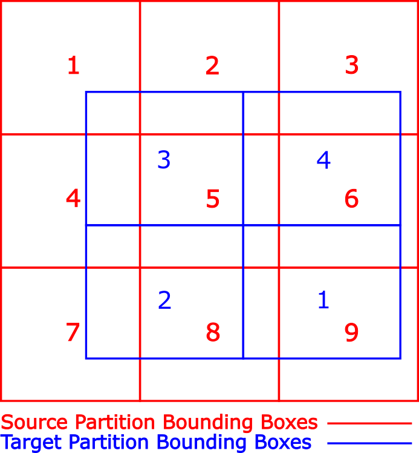

# Coordinate Systems {#coordinate_systems}

In order to be more broadly useful, the Portage framework needs to be able to
support non-Cartesian coordinate systems.  This document will lay out the most
important details of implementing non-Cartesian coordinate systems in Portage.

The most immediate need for this feature is integration with the EAP code base.
Towards that end, the focus will be on certain curvilinear coordinate systems.
However, this will provide a framework that can be used to implement other
coordinate systems[^1].

[^1]: Properties of general orthogonal curvilinear coordinate systems, along
with a handful of examples beyond those discussed here, are summarized nicely
at <https://en.wikipedia.org/wiki/Orthogonal_coordinates>.


## Curvilinear Coordinate System Conventions

There are multiple coordinate system conventions for curvilinear coordinates,
and in practice most people think of their convention as the "One True
Convention".  The closest thing to a standard appears to be ISO 80000-2:2009.
As any choice of convention will bother many readers, we will follow this
standard[^2].  The standard is a right-handed coordinate system with variables
as shown in \tabref{tab:variables}.  It is assumed that all rotational
coordinates are in radians.  If you choose to use another measure for angle
(e.g., degrees), then you may have to rederive some quantities.  A
visualization of this convention is shown in \figref{fig:variables}.

[^2]: This choice seems to bother nearly all of the Portage team, but the
preferred convention varies, reinforcing the idea that there is no
widely-accepted standard.  Making everyone equally angry seems a reasonable
compromise.

[comment]: <> | <td colspan=2> variables </td>

| symbol | meaning |
|:------:|:--------|
| x      | the first Cartesian coordinate |
| y      | the second Cartesian coordinate |
| z      | the third Cartesian coordinate |
| r      | the distance from the origin (spherical radius) |
| $\rho$ | the distance from the z axis (cylindrical radius) |


When running on multiple processors, Portage uses a simple data
distribution algorithm derived from the work of 
Slattery, Wilson, & Pawlowski[1] and Plimpton, Hendrickson, & Stewart[2].

The following 
description applies specifically to mesh-mesh remap.  Redistribution of source 
swarms is similar, but must take into account the support of particles 
(in the form of smoothing lengths) while computing bounding boxes.

For the purposes of this document, distributed remap begins with the call to 
`remap_distributed(...)` within the basic driver call of 
`driver.run(distributed)`.
Each processor node has a partition of both the source and target meshes. The 
spatial extent of the source and target meshes
on a given partition need not have any special relationship. Portage uses 
polytopal intersections of the overlap between source and target cells (or dual
cells in the case of nodal remap) to compute interpolated field values. From this
point forward we will use the word "cell" to refer to either a cell in cell-based
remap or a dual cell in node-based remap.

In order for each target cell to compute interpolated field values it is necessary
to know the geometries of all source cells that intersect it. This presents a 
problem when the source mesh on a partition does not cover the target 
mesh on that partition. The essence of Portage's data distribution is to bring all
source cells that _could_ intersect the target cells on a particular partition onto
that target partition. In `remap_distributed(...)`, data distribution is the 
first nontrivial thing done so that the "search" step
has all the data necessary to work correctly. 
Portage's paradigm of "search, intersect, interpolate" 
requires that any source cells that could potentially intersect a target cell
be available for computation on that target cell's partition. After data 
distribution, each processor node operates exactly as if it were a serial 
problem. This is the explanation of Portage's embarrasingly parallel characterization.
<br/>

<br/>
Portage uses a simple algorithm for data distribution. 
A bounding box is computed for the source and target meshes on each
partition. An MPI_Bcast is used to distribute 
the bounding boxes from all target meshes to each source partition. Bounding box 
intersections determine the processors to 
which each processor must send its source partition. In the figure above, the 
numbered red squares represent the bounding boxes for the partitions of a nominal
source mesh. The numbered blue rectangles represent the bounding boxes for the 
partitions of a nominal target mesh. As seen in the figure, the source and
target meshes do not need to coincident. In this remap problem, target partition
1 would receive data from source partitions 5, 6, 8, and 9; target partition 2 
would receive data from source partitions 4, 5, 7, and 8, etc.

The same communication topology is used for all
subsequent data communication. While sending the entire source partition to a 
target partition that may need only a few of the source cells is somewhat 
inefficient, it is easy to implement.

Many pieces of data are sent from souce partition to target partition. For
each of these pieces of information, two MPI calls need to be made. The first
call establishes the counts of the data that will be sent. The
second MPI call does the actual data distribution. 

It is worthwhile to note that most data is sent making a distinction between 
ghost cells and owned cells. Both ghost and owned data are sent in the same
request, but the counts are kept separately and the sent data
is ordered by owned data first followed by ghost data.
 
The data distributed for remap includes global ids for all entities, node 
coordinates, adjacency information within the mesh, and field values, which is
potentially multi-material. There are
many subtleties in distributing the data. The four most important of which are
removing duplicates, converting local references, handling vector data, 
 and field data that is multi-material. 

The first subtlety is that because of the way that distribution is handled, 
namely whole patches are sent, the same cell may be received from multiple ranks.
A cell may be owned by only one rank, but may also be a ghost on multiple other
ranks. A cell may also only exist as a ghost on any rank. The  duplicates are
eliminated using the global ids of entities that are sent along with the mesh 
information. Additionally, if a duplicate entity was owned on any partition that
it came from, it is considered owned on this partition. 

The second subtlety is that each reference in the adjacency data is represented
inherently by local references (local ids). The same global id for each mesh
entity (cells, faces, and nodes) can be used to update the references to the
new indexing scheme on the partition.


The third subtlety is that MPI data transfer only works with sending vectors of 
uniform type. So any data
transfer needs to conform to this description. In other words, if we need to 
transfer data that is inherently itself vector data, such as a cell centroid, 
it must first be "flattened" to a vector of doubles where the individual 
components of the cell's data are listed in order. Such data must be serialized
to the form (e.g. in 2D)
```
(x1, y1, x2, y2, ..., xn, yn).
```
Upon arrival on the target mesh, the data must then be deserialized to the
original vector form, still with duplicates removed.

The final subtlety is that multi-material fields greatly complicate data 
distribution. Multi-material data in Portage is stored in material-centric 
form, meaning a vector of cells and cell data is kept for each material. 
Material-centric data is composed of cell indices:
```
material 1: cell_id_1, cell_id_3, ...
material 2: cell_id_1, cell_id_4, ...
...
```
with similarly shaped field values:
```
material 1: x11, x13, ...
material 2: x21, x24, ...
...
```
Where in the various `xij's`, the `x` data corresponds to material `i`
in cell `j`. Multi-material data greatly complicates the bookkeeping of 
data distribution because each material acts like it's own mini-mesh. All
multi-material fields are assumed to share the same set of material cells. 
This implies 
that if a material exists in a cell, all multi-material field values must be 
known for that 
material in that cell. 

Distributing multi-material field data requires sending, 
for each partition, the number of materials, the material ids, the number of cells
having each material, the cell ids, and finally the data itself. Just as with 
all other data, since MPI can handle only vectors of uniform type, each of these
"ragged right" data structures must be serialized to vectors of common type on
the source partition before sending and deserialized from vectors to the ragged
right form required by Portage. Finally, multi-material data is inherently more
complicated because of its shape but we still need to remove duplicated data
and update local ids to the new partition.

<br/>

[1] Plimpton, Hendrickson, & Stewart. (2004). A parallel rendezvous algorithm for 
interpolation between multiple grids. Journal of Parallel and Distributed 
Computing, 64(2), 266-276. 

[2] Slattery, S., Wilson, P., & Pawlowski, R. (2013). The Data Transfer Kit: A 
geometric rendezvous-based tool for multiphysics data transfer. International 
Conference on Mathematics and Computational Methods Applied to Nuclear Science 
and Engineering, M and C 2013, 2, 1262-1272.


