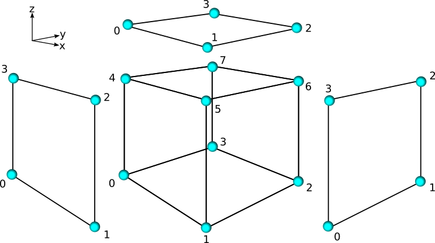
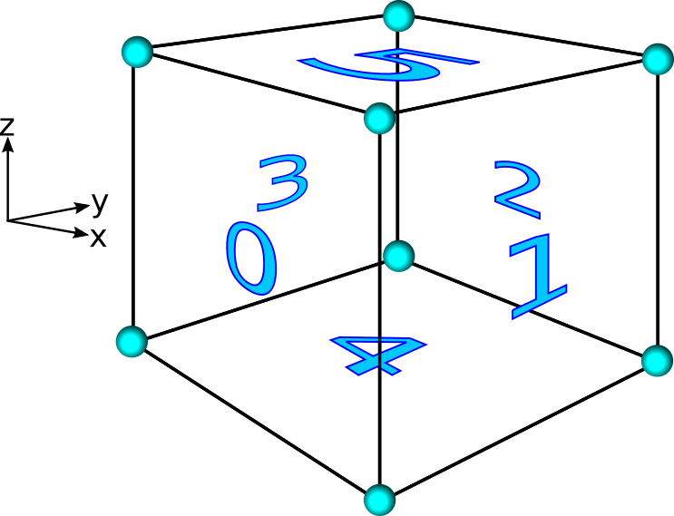
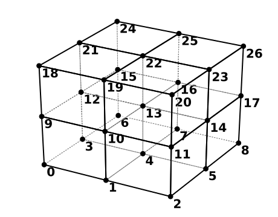
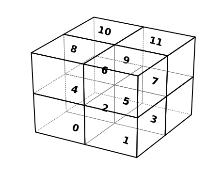
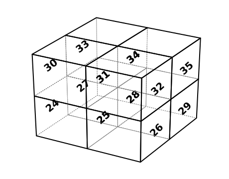
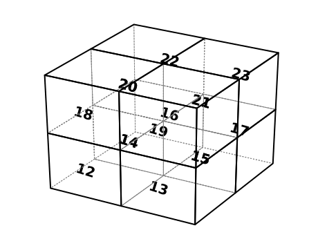

# Simple Mesh Example    {#example}

portage provides very crude mesh and state manager frameworks, aptly called
`Simple_Mesh` and `Simple_State`.  The goal of these frameworks is to show
how you can wrap your favorite mesh and state manager for use with portage.

## High-level portage Workflow

portage provides library functions for remapping data from one mesh (the
_source_ mesh) to a a different mesh (the _target mesh_).  In order to do this,
portage needs to _search_ through the source mesh for possible intersections
with each mesh entity in the target mesh, actually calculate the amount of
_intersection_ with the candidates, and then _interpolate_ the weighted results
onto the target mesh.

## Why Wrappers?

In order to perform the _search_, _intersect_, and _interpolate_ steps of a
remap, portage needs to ask the mesh and statemanager for information about
data, connectivity/neighbors, etc.  In order to do this in a general way,
we have adopted wrappers around mesh frameworks that should implement the
queries required by portage.  It is then up to the user of the mesh and state
manager of choice to make sure those queries are satisfied, in whatever
(read: optimal) choice they choose.

## `AuxMeshTopology`

To facilitate wrapping, we provide a class called Portage::AuxMeshTopology,
which implements
the
[Curiously Recurring Template Pattern](https://en.wikipedia.org/wiki/Curiously_recurring_template_pattern) to
implement static polymorphism.  In short, this means that
AuxMeshTopology is templated on a mesh wrapper class, which should be
able to answer basic questions about cells and nodes (and faces and
edges, depending on the dimension).  AuxMeshTopology then can build
more advanced mesh connectivity information, such as sides, wedges,
and corners (see the *Simple Mesh* section below).

A concrete example is the Portage::AuxMeshTopology::num_entities()
function.  This function takes a Portage::Entity_kind (
e.g. Portage::CELL or Portage::NODE) and a Portage::Entity_type
(e.g. Portage::PARALLEL_OWNED or Portage::PARALLEL_GHOST) and returns
the appropriate number of entities of that type and kind.  Under the
hood, it calls the base mesh wrapper class' functions
(e.g. Portage::Simple_Mesh_Wrapper::num_owned_faces()) where applicable, or
can call its own functions for information about more advanced
entities (e.g. Portage::AuxMeshTopology::num_ghost_sides()).

**NOTE:** When wrapping a new mesh framework, one does not _need_ to use
AuxMeshTopology, especially if your mesh framework already supports
the advanced mesh entities; it is simply a convenience tool.

## Methods Wrapped

This is a list of methods needed by a mesh wrapper during a typical
flow through portage.  This is the list of things needed with and in addition to
using Portage::AuxMeshTopology class.  The examples here are concrete examples
using the Portage::Simple_Mesh_Wrapper class as a reference.

<dl>
	<dt>General mesh info</dt>
		<dd>Portage::Simple_Mesh_Wrapper::space_dimension()</dd>
		<dd>Portage::Simple_Mesh_Wrapper::cell_get_type()</dd>
		<dd>Portage::Simple_Mesh_Wrapper::cell_get_element_type()</dd>
		<dd>Portage::Simple_Mesh_Wrapper::get_global_id()</dd>
	<dt>`num_X_Y` for various entities</dt>
		<dd>Portage::Simple_Mesh_Wrapper::num_owned_cells()</dd>
		<dd>Portage::Simple_Mesh_Wrapper::num_owned_faces()</dd>
		<dd>Portage::Simple_Mesh_Wrapper::num_owned_nodes()</dd>
		<dd>Portage::Simple_Mesh_Wrapper::num_ghost_cells()</dd>
		<dd>Portage::Simple_Mesh_Wrapper::num_ghost_faces()</dd>
		<dd>Portage::Simple_Mesh_Wrapper::num_ghost_nodes()</dd>
	<dt>Connectivity information</dt>
		<dd>Portage::Simple_Mesh_Wrapper::node_get_cell_adj_nodes()</dd>
		<dd>Portage::Simple_Mesh_Wrapper::cell_get_node_adj_cells()</dd>
		<dd>Portage::Simple_Mesh_Wrapper::cell_get_faces_and_dirs()</dd>
		<dd>Portage::Simple_Mesh_Wrapper::cell_get_nodes()</dd>
		<dd>Portage::Simple_Mesh_Wrapper::face_get_nodes()</dd>
	<dt>Spatial information</dt>
		<dd>Portage::Simple_Mesh_Wrapper::node_get_coordinates()</dd>
</dl>

## Simple Mesh

The Portage::Simple_Mesh class provides a concrete example of a basic regular
Cartesian mesh framework in 3d.  Simple_Mesh is _not_ designed for
production, and is currently only serial-capable -- it does not have
any ghost information, so queries to ghost entities simply return 0.

Simple_Mesh only knows about cells, faces, and nodes.  A Simple_Mesh
is constructed by passing in the lower and upper extents of the
rectangular prism that makes up the domain, and the number of cells in
each direction.  All the cells, faces, and nodes are then created as
simple indices, and connectivity is built from these indices with an
assumed ordering, as shown below.

@image latex doxygen/images/simple_mesh/cell-blowup.png "Blowup of local node ordering." width=\textwidth

@image latex doxygen/images/simple_mesh/cell-faces.png "Local face ordering for a cell." width=\textwidth

## Simple State

The state manager associated with the Portage::Simple_Mesh framwork is
Simple_State.  The field data is stored within a STL vectors inside a
map that maps a <kbd>(var_name, Entity_kind)</kbd> pair key to the
data.  The global indices stored within Simple_Mesh correspond to the
specific index into the vector of field data stored in Simple_State.
