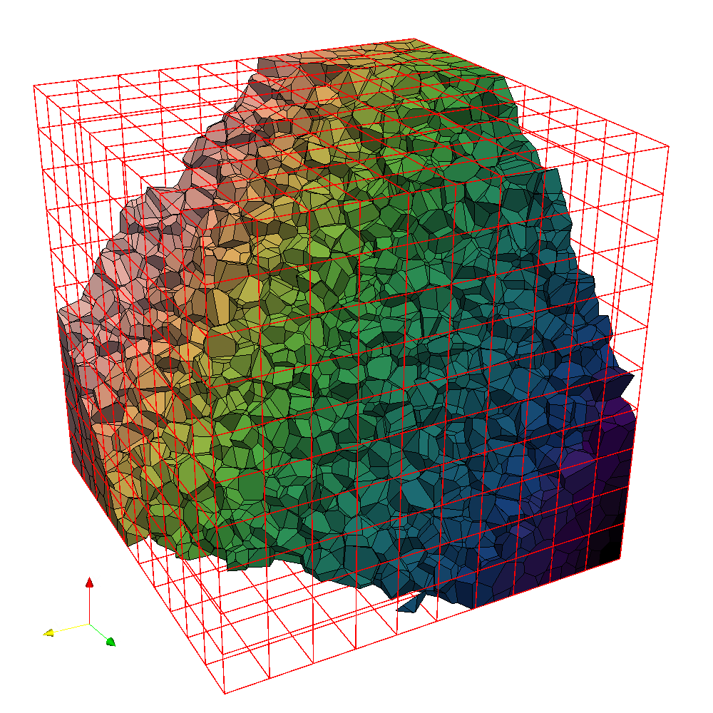

# Examples  {#example}

Portage provides very crude mesh and state manager frameworks aptly
called `Simple_Mesh` and `Simple_State` through its support package, 
[Wonton](https://github.com/laristra/wonton).  The goal of these frameworks
is to show how one can wrap their favorite mesh and state manager for
use with Portage - _they should not be used in any production sense._
The details on the `Wonton::Simple_Mesh` and `Wonton::Simple_State` 
frameworks, and its wrappers `Wonton::Simple_Mesh_Wrapper` and 
`Wonton::Simple_State_Wrapper`, can be found in the
[Wonton](https://github.com/laristra/wonton) documentation.

## Wrappers

As mentioned on the [Concepts](@ref concepts) page, the search,
intersect, and interpolate actions in Portage all operate on
mesh and particle wrappers for geometry and topology access, 
and state wrappers for data access. The reason for using wrapper 
classes instead of the native classes directly is that Portage
may need some information that may not be
readily available within the original mesh/particle and state
frameworks, but could be constructed within a wrapper.

Portage's support package, [Wonton](https://github.com/laristra/wonton), 
provides a helper class, `Wonton::AuxMeshTopology`, that assists in
extending a basic mesh's topological entities needed for some remap
capabilities.  One does not _need_ to use the AuxMeshTopology class,
especially if one's mesh already efficiently supports the advanced
mesh topologies. 
In particular, the advanced mesh topologies and entities, which we
term _sides_, _corners_, and _wedges_ are utilized in node-centered
remapping, but are also _required_ if there are cells with non-planar
faces in the remap.  

# Putting it all Together

Let us illustrate the usage of Portage with a few lines of code. 
First, we create two square meshes in a unit square domain with 16 and
25 computational cells, respectively:

~~~cpp
Wonton::Simple_Mesh sourceMesh = std::make_shared<Simple_Mesh>(0.0, 0.0, 1.0, 1.0, 4, 4);
Wonton::Simple_Mesh targetMesh = std::make_shared<Simple_Mesh>(0.0, 0.0, 1.0, 1.0, 5, 5);
~~~

Then, we wrap the meshes with a Portage-compatible wrapper

~~~cpp
Wonton::Simple_Mesh_Wrapper sourceMeshWrapper(*sourceMesh);
Wonton::Simple_Mesh_Wrapper targetMeshWrapper(*targetMesh);
~~~

Assuming that we have cell data `inputData` for the source mesh, 
we need to register data with state wrappers

~~~cpp
Wonton::Simple_State_Wrapper<Wonton::Simple_Mesh_Wrapper> 
		sourceStateWrapper(sourceMeshWrapper);
	sourceStateWrapper.add(std::make_shared<Wonton::StateVectorUni<>>
		("celldata", Entity_kind::CELL, inputData));
Wonton::Simple_State_Wrapper<Wonton::Simple_Mesh_Wrapper> 
		targetStateWrapper(targetMeshWrapper);
	targetStateWrapper.add(std::make_shared<Wonton::StateVectorUni<>>
		("celldata", Entity_kind::CELL, targetData));
~~~

Now, we are ready to call a driver to perform remap of `inputData` from 
`sourceMesh` to the `targetMesh` via the wrappers: 

~~~cpp
Portage::MMDriver<
	Portage::SearchKDTree,
	Portage::IntersectR3D,
	Portage::Interpolate_2ndOrder,
	dim,
	Wonton::Simple_Mesh_Wrapper,
	Wonton::Simple_State_Wrapper<Simple_Mesh_Wrapper>>
		d(sourceMeshWrapper, sourceStateWrapper,
			targetMeshWrapper, targetStateWrapper);
	d.set_remap_var_names(remap_fields);
	d.run(false);
~~~

Here, `dim=2` is referring to number of spatial dimensions of the problem, 
`remap_fields` is a vector containing a string "celldata", and the first 
three arguments represent particular methods of search, intersect, and
interpolate steps as described in [Concepts](@ref concepts).

This simple example covers an atypical case where we do not have a source mesh 
nor any field data on it. Therefore, we added a state vector initialized from our own 
data vector called inputData. Normally, however, the source mesh would already 
have such a field on it and we would just have to add empty data to the target mesh
to make sure we can remap into it.

In the next example, we demonstrate a more typical situation of reading source
and target meshes from files `source.exo` and `target.exo` using Jali. Instead of 
using the driver, we instantiate Search, Intersect and Interpolate classes directly:

~~~cpp
std::shared_ptr<Jali::Mesh> sourceMesh;
Jali::MeshFactory mf(MPI_COMM_WORLD);
mf.included_entities({Jali::Entity_kind::ALL_KIND});
mf.partitioner(Jali::Partitioner_type::METIS);
source_mesh = mf("source.exo");
~~~

We create a native Jali state manager for a source mesh.

~~~cpp
std::shared_ptr<Jali::State> sourceState(Jali::State::create(sourceMesh));
~~~

Additionally, we can add cell data from a vector `sourceData` to a state manager.

~~~cpp
sourceState->add("celldata", sourceMesh, Jali::Entity_kind::CELL, Jali::Entity_type::ALL, &(sourceData[0]));
~~~

Next, we read and wrap a target mesh and add empty data to it.

~~~cpp
std::shared_ptr<Jali::Mesh> targetMesh;
mf.partitioner(Jali::Partitioner_type::METIS);
target_mesh = mf("target.exo");
std::shared_ptr<Jali::State> targetState(Jali::State::create(targetMesh));
targetState->add<double, Jali::Mesh, Jali::UniStateVector>("celldata",
                                                            targetMesh,
                                                            Jali::Entity_kind::CELL,
                                                            Jali::Entity_type::ALL, 0.0);
~~~

Both meshes are wrapped for interfacing with the underlying mesh data structures.

~~~cpp
Wonton::Jali_Mesh_Wrapper sourceMeshWrapper(*sourceMesh);
Wonton::Jali_Mesh_Wrapper targetMeshWrapper(*targetMesh);
~~~

We get an instance of the desired search algorithm type in `dim` spatial dimensions 
for a cell field.

~~~cpp
const Search<dim, Entity_kind::CELL, Wonton::Jali_Mesh_Wrapper, Wonton::Jali_Mesh_Wrapper>
      search(sourceMeshWrapper, targetMeshWrapper);
~~~

Now, we apply Portage wrappers for source and target fields.

~~~cpp
Wonton::Jali_State_Wrapper sourceStateWrapper(*sourceState);
Wonton::Jali_State_Wrapper targetStateWrapper(*targetState);
~~~

Further, we make an intersector which knows about the source state (to be able
to query the number of materials, etc). `DummyInterfaceReconstructor` and two 
`void` arguments indicate that we want to perform intersections of a single-material 
filed. 

~~~cpp
Intersect<Entity_kind::CELL, Wonton::Jali_Mesh_Wrapper, Wonton::Jali_State_Wrapper,
		Wonton::Jali_Mesh_Wrapper, DummyInterfaceReconstructor,
		void, void>
	intersect(sourceMeshWrapper, sourceStateWrapper, targetMeshWrapper);
~~~

Finally, we get an instance of the desired interpolate algorithm type.

~~~cpp
Interpolate<dim, Entity_kind::CELL, Wonton::Jali_Mesh_Wrapper, Wonton::Jali_Mesh_Wrapper,
		Wonton::Jali_State_Wrapper, DummyInterfaceReconstructor,
		void, void>
	interpolate(sourceMeshWrapper, sourceStateWrapper, targetMeshWrapper);
~~~

# Existing Applications and Tests

Nearly all of the generic unit tests have been designed to work with
the `Wonton::Simple_Mesh_Wrapper` and `Wonton::Simple_State_Wrapper`
data structures when a mesh with a topology and field data are required. These should serve
as examples of the types of things one may want to do with a mesh and
state framework.

## Simple_mesh_app

Better examples of how to use these wrappers to actually do a remap of
field data are in the application tests.  In particular, the
`app/simple_mesh_app/simple_mesh_app.cc` program shows how to wrap
mesh and state objects, adds some field data to the source state, and
utilize `Portage::MMDriver` with various search, intersect, and
interpolate algorithms to perform the remap.  The `Portage::MMDriver` is
templated on mesh wrapper type and state wrapper type, and can be used
with other frameworks. `Portage::MMDriver` and `Portage::SwarmDriver` 
are a good starting point for writing one's own remap application.

## Portageapp_jali

This application demonstrates how to remap (scalar) field data using the Jali mesh 
infrastructure. The application `app/portageapp/portageapp_jali.cc` is capable
of remapping cell and nodal fields defined on square/cubic meshes or on  
unstructured meshes in 2D and 3D, respectively. 

The app allows users to specify an analytic field on a source mesh. This is done 
by an algebraic expression in the standard input, see options and examples below. 
The app can also remap all the fields that are on a source mesh that is 
read from a file.    
An error of remap is calculated by comparing remapped values to exact values in the 
cell-centroids/nodes on a target mesh and the error is printed to standard output. 
The remapped field on a target mesh is saved into a file `output.exo` 
if it is not specified otherwise. The app can be run using e.g.     

~~~sh
portageapp_jali \
    --dim=3 \
    --nsourcecells=12 \
    --ntargetcells=8 \
    --field='x+2*y-3*z' \
    --remap_order=2
~~~

More options can by explored by executing 

~~~sh
portageapp_jali --help

Usage: portageapp --dim=2|3 --nsourcecells=N --ntargetcells=M --conformal=y|n 
--entity_kind=cell|node --field="your_math_expression" --remap_order=1|2 
--limiter=barth_jespersen --mesh_min=0. --mesh_max=1. 
--output_meshes=y|n --results_file=filename
~~~

## Portageapp_multimat_jali

Similar to `portageapp_jali` for mesh fields, `app/portageapp/portageapp_multimat_jali` 
demonstrates Portage's ability to remap multi-material fields. In order to preserve sharp
interfaces between materials, Portage relies on [Tangram](https://github.com/laristra/tangram) 
to perform interface reconstruction
on the source mesh. Reconstructed material polygons are intersected with cells on a target 
mesh. An input file specifying volume fractions (and optionally material centroids 
for MOF) is required in addition to the meshes and multiple material fields. 
For now, this app works only in serial.

~~~sh
portageapp_multimat_jali \
    --dim=2 \
    --source_file=reg10x10.exo \
    --target_file=polymesh_10x10.exo \
    --material_fields='5*x-y,2*x+4+3*y,-2*x-y' \
    --material_file=reg10x10.bvf 
~~~ 
